[简体中文](README.md) | **English**

# mini-im

[](https://github.com/kite88/mini-im/releases/latest)
[](LICENSE)

An instant-messaging / customer-service system built with Go + Gin + GORM (PostgreSQL) + Redis.

The front end is a plain Vue 2 + Axios static page served directly by the backend — no build step.
The same page adapts responsively to desktop and mobile, with no bundler and no external image assets.

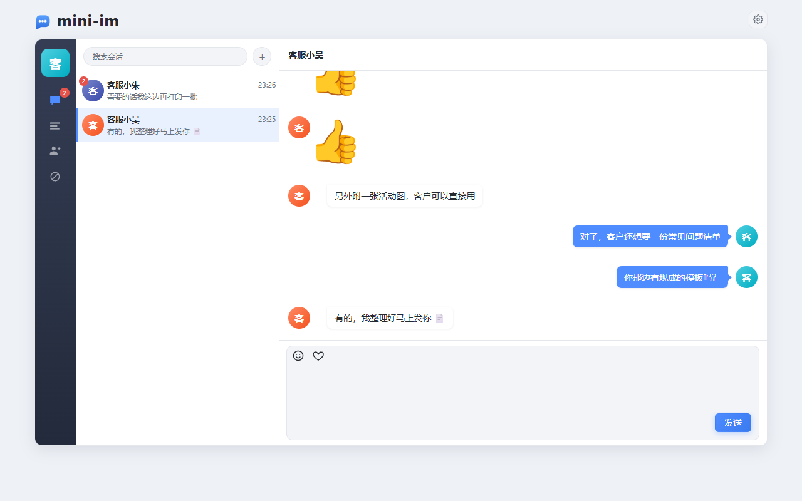

---

## Contents

- [UI preview](#ui-preview)
- [Quick start](#quick-start)
- [Feature walkthrough](#feature-walkthrough)
- [API](#api)
- [End-to-end regression](#end-to-end-regression)
- [Project layout](#project-layout)
- [Tables](#tables)
- [Redis keys](#redis-keys)
- [Design notes](#design-notes)
- [Deployment notes](#deployment-notes)
- [Changelog](#changelog)
- [License](#license)

---

## UI preview

> Every screenshot below was taken with the demo accounts created by the `seed` section of `config.yaml`
> (客服小哈 / 客服小吴 / 客服小朱 / 客服505). Set `seed.enabled` to `true` and restart to get the exact
> same starting data.

### Desktop

| Conversation list (with unread badge) | Chat view |
| --- | --- |
| 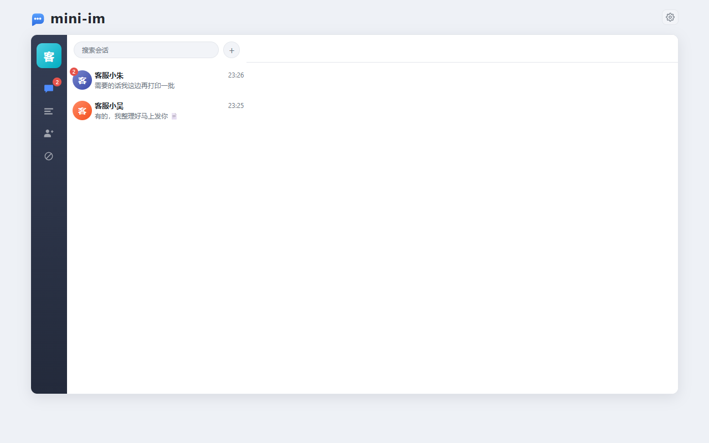 |  |

| Search users / send a friend request | Blocklist |
| --- | --- |
| 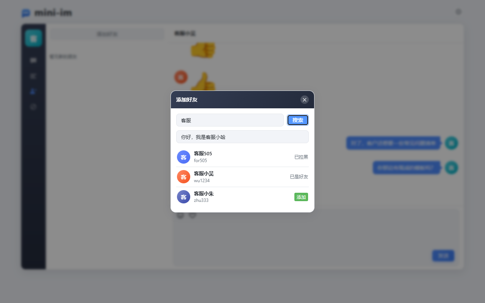 | 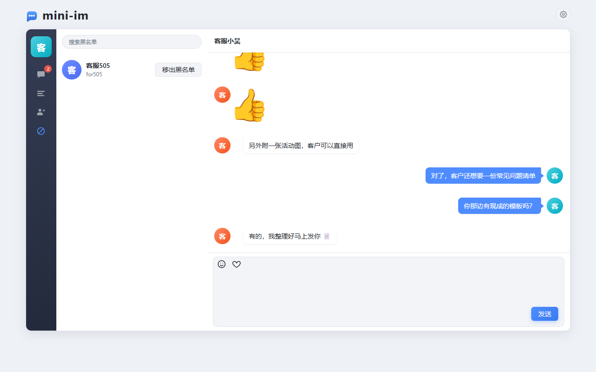 |

### Mobile

| Sign in | Conversation list | Chat | Settings |
| --- | --- | --- | --- |
| 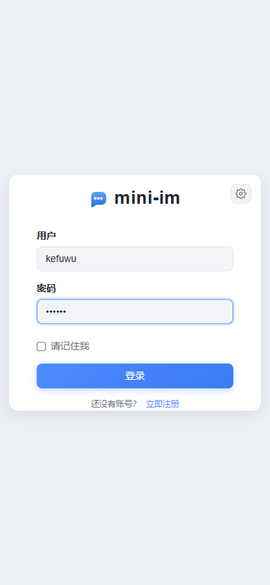 | 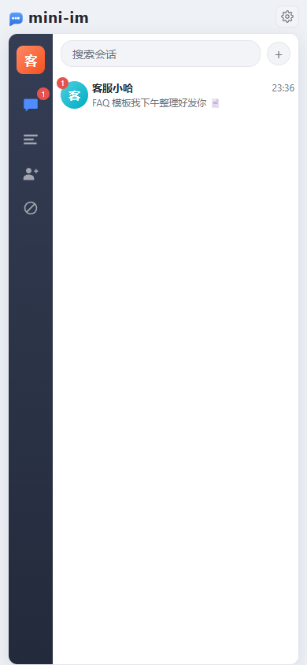 | 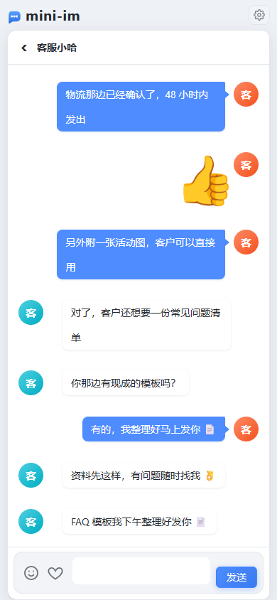 | 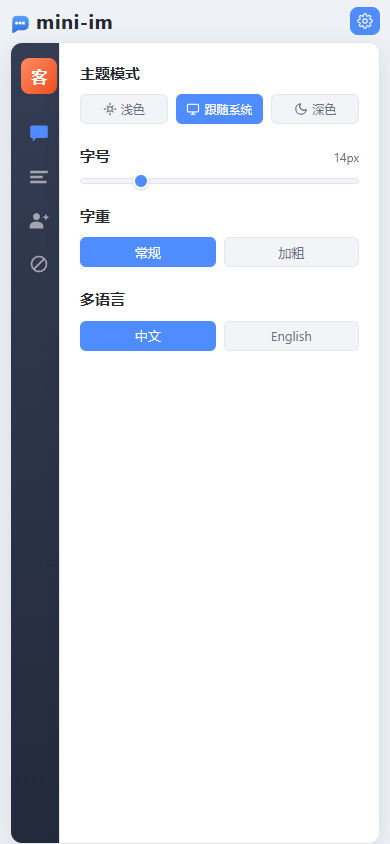 |

### Dark theme and i18n

| Desktop dark | Mobile dark | English |
| --- | --- | --- |
|  | 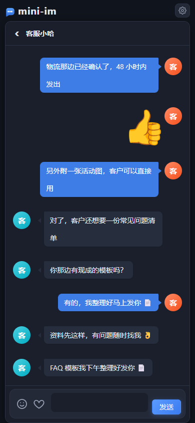 | 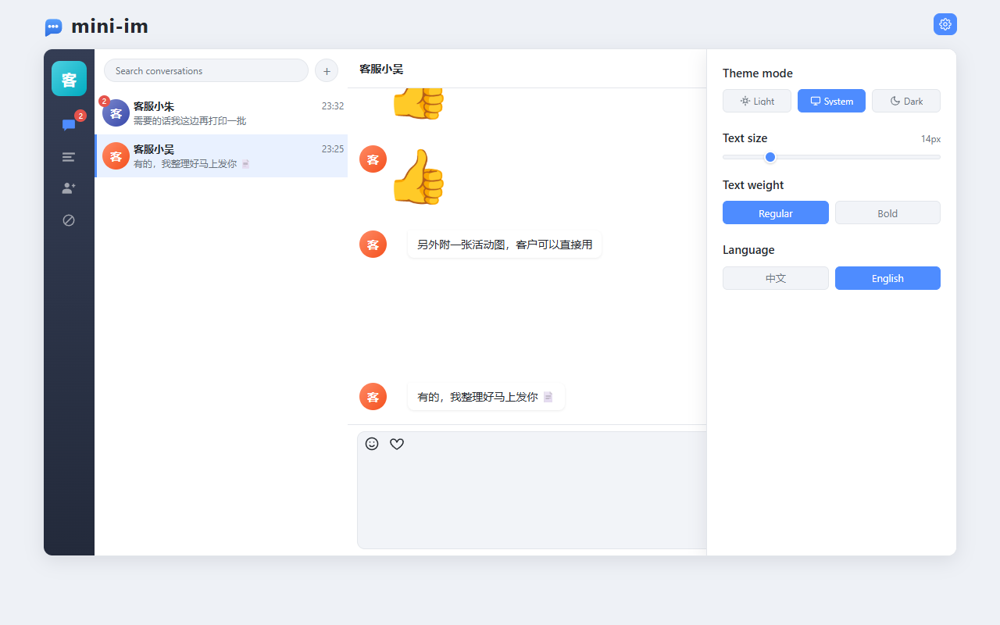 |

---

## Quick start

```bash
docker compose up -d          # start PostgreSQL + Redis (skip if you run them natively)
go run .                      # start the service
```

Open <http://127.0.0.1:2580/> — it redirects to `/web/index.html`.
When no token is present the front end sends you to `/web/login.html`; register or sign in to reach the chat page.

A fresh database is empty, so just register on the login page (username: 6-20 chars of letters, digits,
underscores or hyphens; password: at least 6 chars), then use **New Friends → Add Friend** on the left to
search by username or nickname and send a request. Once the other side accepts, you can chat both ways.

### Demo accounts (opt-in)

`seed.enabled` in `config.yaml` defaults to `false`. Set it to `true` and restart to create the accounts
below and **make every pair mutual contacts**, so you can chat out of the box. The password comes from
`seed.password` (default `123123`):

| Username | Nickname |
| --- | --- |
| `ha1234` | 客服小哈 &nbsp;(Agent Ha) |
| `wu1234` | 客服小吴 &nbsp;(Agent Wu) |
| `zhu333` | 客服小朱 &nbsp;(Agent Zhu) |
| `for505` | 客服505 &nbsp;(Agent 505) |

Both the usernames and the nicknames live in `seed.accounts` of `config.yaml` — add or remove entries as you like:

```yaml
seed:
  enabled: false            # set to true and restart to take effect
  password: "123123"
  accounts:
    - { username: ha1234,  nickname: 客服小哈 }
    - { username: wu1234,  nickname: 客服小吴 }
    - { username: zhu333,  nickname: 客服小朱 }
    - { username: for505,  nickname: 客服505 }
```

Seeding is idempotent: if an account already exists, only the nickname and avatar are filled in — the password
is never overwritten — so restarting repeatedly is safe.
Seed accounts are written straight to the database and bypass the registration endpoint, so they are not subject
to the registration rules (username 6-20 chars).

### Requirements

- Go 1.23+
- PostgreSQL (the database must exist; tables are auto-migrated by GORM)
- Redis

Without `docker compose`, just create the database by hand:

```sql
CREATE DATABASE "mini-im" ENCODING 'UTF8';
```

### Configuration

`config.yaml` defaults to: PostgreSQL `127.0.0.1:5432` / `postgres` / `123456` / database `mini-im`,
Redis `127.0.0.1:6379` DB `1`, HTTP port `2580`.
`app.name` (default `mini-im`) is also used as the Redis key prefix, so changing it is equivalent to switching
to a whole new cache namespace.

Everything except `seed.*` can be overridden with environment variables, so container deployments need no file edits:

```bash
IM_PG_HOST=pg IM_PG_PASSWORD=secret IM_REDIS_ADDR=redis:6379 IM_JWT_SECRET=xxx go run .
```

<details>
<summary>All environment variables</summary>

| Variable | Description |
| --- | --- |
| `IM_APP_NAME` | Application name, also the Redis key prefix |
| `IM_HTTP_PORT` / `IM_RUN_MODE` / `IM_WEB_DIR` | Port, mode, static asset directory |
| `IM_PG_HOST` `IM_PG_PORT` `IM_PG_USER` `IM_PG_PASSWORD` `IM_PG_DBNAME` `IM_PG_SSLMODE` | PostgreSQL connection |
| `IM_REDIS_ADDR` `IM_REDIS_PASSWORD` `IM_REDIS_DB` | Redis connection |
| `IM_JWT_SECRET` `IM_JWT_EXPIRE` | JWT secret and lifetime (seconds) |
| `IM_SNOWFLAKE_NODE_ID` | Snowflake node id (0~1023, default -1 = derived from the local NIC address); only affects users and friend requests |

`seed.*` has no environment-variable override — only the config file can toggle it.

</details>

In production, always inject the secret through `IM_JWT_SECRET` instead of keeping the default value.

`snowflake.node_id` defaults to `-1`, meaning the node id is derived from the machine's NIC address.
**In a multi-instance deployment you must set a different explicit value (0~1023) per instance**, otherwise two
instances may generate the same user / friend-request ID within the same millisecond.
Message primary keys are UUID v7 and carry no node id, so they need no coordination across instances.

---

## Feature walkthrough

The sections below follow one complete usage flow, and every screenshot is a real running UI
(desktop 1280×800, mobile 390×844).

### 1. Sign up and sign in

| Sign in | Sign up |
| --- | --- |
| 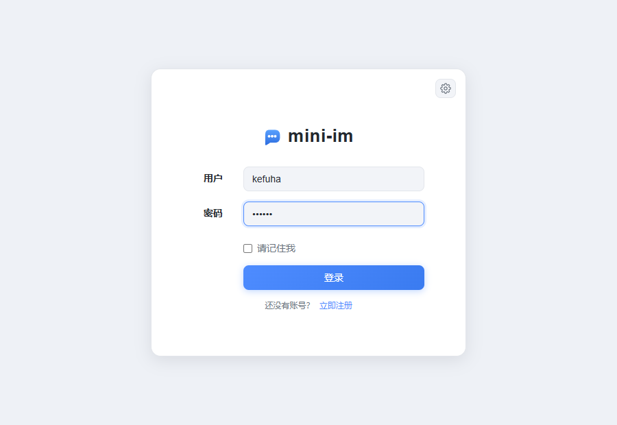 | 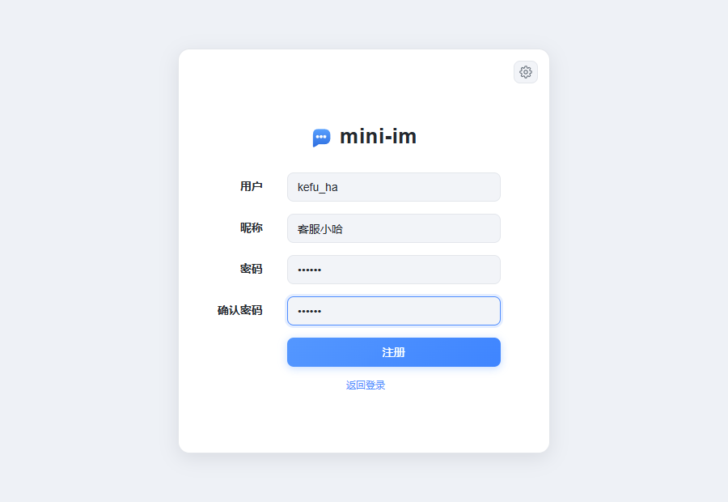 |

Sign-in and sign-up are two states of the same page: username 6-20 chars (letters, digits, underscore or hyphen),
password at least 6 chars, nickname optional and falling back to the username when left blank.
Ticking "remember me" persists the session in `localStorage` so the next visit goes straight to the chat page;
when the token has less than 12 hours left, the front end renews it automatically.

If the same account signs in elsewhere, the older session's token is invalidated immediately: the front end pops
up "账号在别处登录，尝试重新登录" ("signed in elsewhere, please sign in again"), clears the local state and
returns to the login page (single sign-on — see [Design notes](#design-notes)).

### 2. Search and add a contact

Click the `+` at the top left, or the button on the New Friends page, to open **Add Friend**.
Search by username or nickname and each result is annotated with your relationship to that user
(addable / requested / awaiting your response / already contacts / blocked), plus an optional
verification message of up to 100 characters.


### 3. Friend requests

When someone sends a request the target receives a `friend_request` event in real time and the
New Friends entry in the left nav shows a badge. Accept or reject right from the list; on accept both sides
become contacts immediately and the sender receives a `friend_accepted` event.

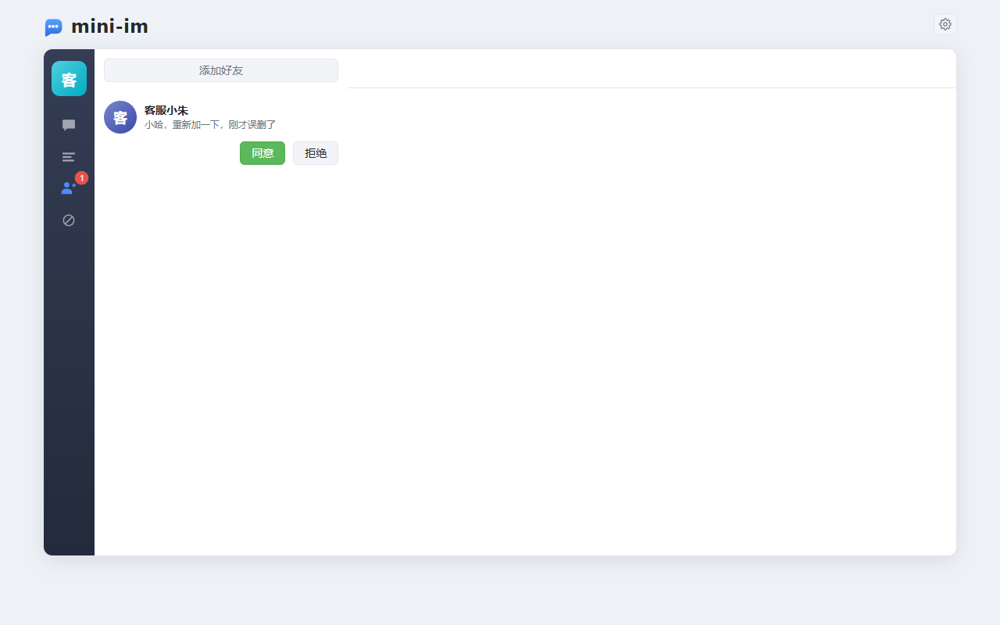

### 4. Chat

The chat view supports text, emoji and image stickers (an image is an HTML fragment carried as the message
content with `content_type=image`). Messages sent while the peer is offline go into an offline queue and are
replayed in their original order once they come back online.
The unread count is computed server-side from the read cursor, and opening a conversation marks it as read.

| Desktop chat | Mobile chat |
| --- | --- |
|  |  |

Before forwarding, the server verifies that the two users are **still contacts** and that the **recipient has
not blocked the sender**. If either check fails the message is neither forwarded nor stored: the sender only
receives an event and the optimistically rendered local copy is rolled back.

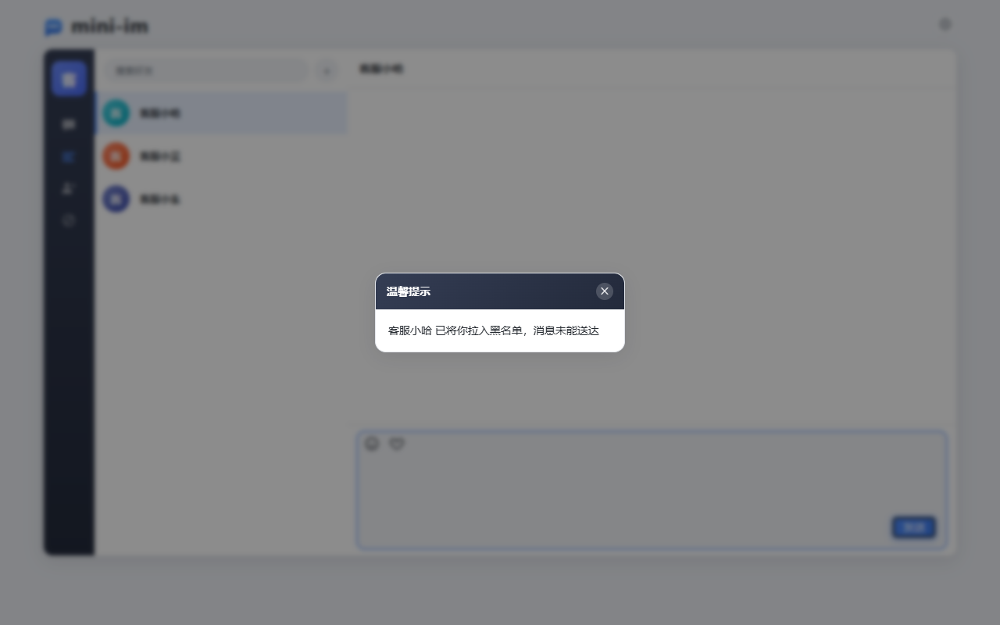

| event | Meaning |
| --- | --- |
| `blacklisted` | The recipient has blocked me (screenshot above) |
| `unfriended` | The recipient removed me from their contacts |
| `not_friend` | We were never contacts, or I already removed them |

### 5. Contact management: delete and block

Hovering a contact row reveals **Block** and **Delete**; both ask for confirmation first.
Deleting a contact is a **one-sided soft delete**: only my own list and chat history are cleared, the other side
is unaffected — but neither side can send messages any more, and adding each other again starts an empty conversation.

| Contact list (actions on hover) | Delete confirmation |
| --- | --- |
| 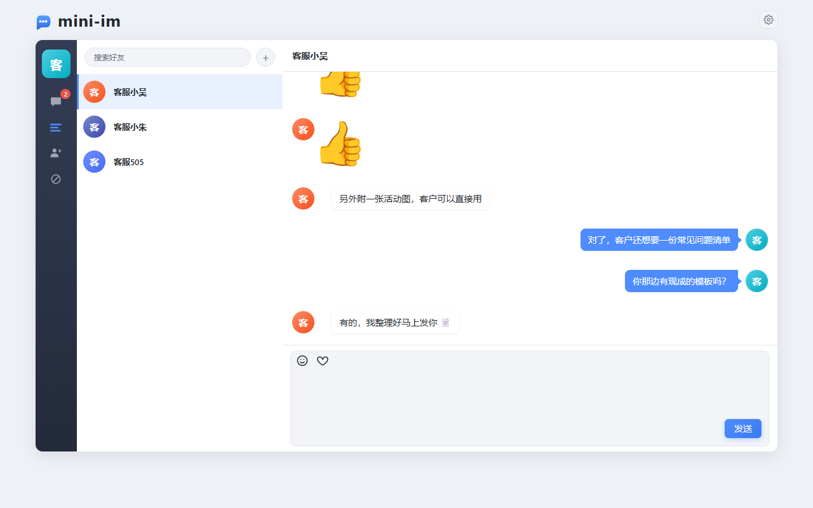 | 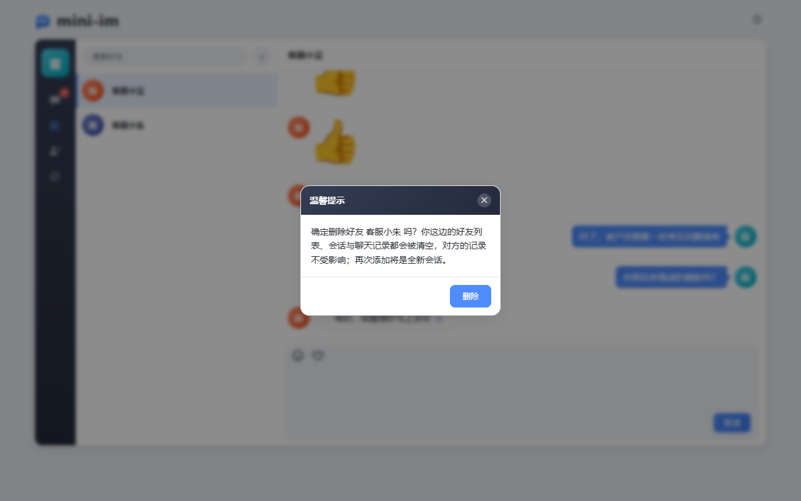 |

Blocking is one-sided as well: the blocked user disappears from my contact list and conversation list
(neither the friendship row nor the chat history is deleted), only the "blocked → blocker" direction is
intercepted, and the entry can be removed from the Blocklist page at any time — doing so restores everything.


### 6. Settings: theme, font size, weight, language

The gear icon in the top right opens the settings drawer; changes apply immediately and are persisted in `localStorage`.

| Light | Dark |
| --- | --- |
| 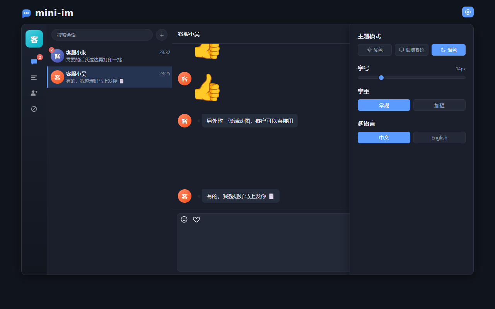 |  |

### 7. Mobile

Mobile is a responsive layout of the very same page (breakpoint `991px`): the left nav collapses into a narrow
rail, and opening a conversation slides the full-screen chat panel in with a back arrow at the top.
The composer is a WeChat-style single-line bar; the textarea font is ≥16px so that iOS does not zoom on focus,
and `visualViewport` is observed to keep the composer above the on-screen keyboard.

| Sign in | Conversation list | Chat (full screen) | Settings |
| --- | --- | --- | --- |
|  |  |  |  |

---

## API

Authentication: `Authorization: Bearer <token>`.

| Method | Path | Auth | Description |
| --- | --- | --- | --- |
| POST | `/api/register` | no | Register an account (username 6-20 chars: letters, digits, `_` or `-`; password ≥ 6 chars) |
| POST | `/api/login` | no | Sign in, returns `user` and `tokens` |
| PUT | `/api/token` | yes | Renew the token |
| POST | `/api/logout` | yes | Sign out |
| GET | `/api/friends` | yes | Contact list (excluding users I have blocked) |
| DELETE | `/api/friends/:FID` | yes | Delete a contact (one-sided: my list and conversation are cleared, the other side is untouched) |
| GET | `/api/messages` | yes | Conversation list, one entry per peer with only the latest message plus the unread count (excluding users I have blocked) |
| GET | `/api/chats/:FID` | yes | Chat history with the given contact |
| POST | `/api/read/:FID` | yes | Mark the conversation with the given contact as read |
| GET | `/api/users?keyword=` | yes | Search users by username / nickname, including the relationship to me |
| POST | `/api/friend-requests` | yes | Send a friend request (`{to_id, message}`) |
| GET | `/api/friend-requests` | yes | Friend requests awaiting my response |
| POST | `/api/friend-requests/:ID/accept` | yes | Accept a friend request |
| POST | `/api/friend-requests/:ID/reject` | yes | Reject a friend request |
| GET | `/api/blacklist` | yes | Users I have blocked (newest first) |
| POST | `/api/blacklist` | yes | Add to the blocklist (`{user_id}`, idempotent) |
| DELETE | `/api/blacklist/:UID` | yes | Remove from the blocklist |
| GET | `/ws?token=xxx` | yes | WebSocket long connection; an `Authorization` header also works |
| GET | `/avatar?name=&label=` | no | Dynamically generated SVG avatar |
| GET | `/healthz` | no | Health check, returns the number of live connections |

### Response format

```json
{ "StatusCode": 0, "Message": "请求成功", "Data": {} }
```

| Code | Meaning |
| --- | --- |
| `0` | Success |
| `-1` | Business failure, the reason is in `Message` |
| `-10` | Not signed in / session expired / signed in elsewhere; the front end clears the local state and returns to the login page |

The HTTP status code is always 200 (except a failed WebSocket authentication, which returns 401); the business
outcome is only reflected in `StatusCode`. List endpoints return `[]` when empty and other endpoints return `{}`,
never `null`. Response messages are currently returned in Chinese by the server.

### Login example

```http
POST /api/login
Content-Type: application/json

{ "username": "ha1234", "password": "123123" }
```

```json
{
  "StatusCode": 0,
  "Message": "登录成功",
  "Data": {
    "user": {
      "id": "364066726138089472",
      "username": "ha1234",
      "nickname": "客服小哈",
      "avatar": "/avatar?label=%E5%AE%A2%E6%9C%8D%E5%B0%8F%E5%93%88&name=ha1234"
    },
    "tokens": { "token": "eyJhbGciOi...", "exp": 1790843147 }
  }
}
```

> `im_user` / `im_friend_request` IDs are Snowflake IDs (18~19 digits) and exceed the JavaScript safe integer
> range (2^53), so they are always serialized as **strings** in JSON; message primary keys are UUID v7 and are
> strings by nature. Small integers such as `create_time` and `msg_count` stay numeric, while `content_type`
> is a string identifier (see below).

`GET /api/chats/364066726138089472` returns an array whose elements carry two extra read-only fields on top of
the entity fields:

```json
{
  "id": "01a0f691-d2f8-7a3d-9e2f-4b6a8c1d5e70",
  "content_type": "text",
  "content": "你好 👋",
  "user_id": "364066726138089472",
  "friend_id": "1",
  "create_time": 1790843147,
  "type": 1,
  "user": { "id": "1", "nickname": "客服小哈", "avatar": "/avatar?..." }
}
```

`type` is `1` for messages I sent and `2` for messages the peer sent; it is computed only when serializing.
The list is ordered by `create_time` descending and the front end reverses it before rendering; a single
conversation returns at most 200 messages.

An element of the conversation list `GET /api/messages` looks like this:

```json
{
  "time": 1790843147,
  "message": "你好 👋",
  "content_type": "text",
  "uid": "364066726138089472",
  "msg_count": 2,
  "user": { "id": "364066726138089472", "nickname": "客服小哈", "avatar": "/avatar?..." }
}
```

`uid` is the peer's ID and `msg_count` is the unread count derived from the read cursor, cleared by
`POST /api/read/:FID`.

### WebSocket

Connect to `ws://127.0.0.1:2580/ws?token=<token>`; the first message you receive has the content
`socket服务连接成功` ("socket connected"), followed by any queued offline messages in order.

Upstream frame:

```json
{
  "sender": "",
  "recipient": "2",
  "content": "你好",
  "content_type": "text",
  "subjoin": { "avatar": "", "nickname": "" }
}
```

`sender`, `time` and `subjoin` are filled in by the server — whatever the client sends is ignored.
`content_type` is a string identifier: `text` for text and `image` for an image (whose content is an HTML
fragment); unknown values are normalized to `text` by the server.
A single frame is capped at 8KB and larger frames close the connection. Downstream frames use the same shape.

Before forwarding, the server validates in order that the two users are **still contacts** (once either side
deletes the contact, messages are no longer deliverable) and that the **recipient has not blocked the sender**.
If either fails nothing is forwarded or stored, and the sender receives a
`not_friend` / `unfriended` / `blacklisted` event.

The server also pushes **business events** proactively. Those frames contain only `event` and `data`, and the
front end just refreshes the corresponding list when it receives one (they are dropped while offline, but the
same data is still visible by calling the API after signing in):

```json
{
  "event": "friend_request",
  "data": { "id": "364070295146860544", "nickname": "AddTest", "avatar": "/avatar?...", "message": "你好" }
}
```

| event | When it fires | `data` payload |
| --- | --- | --- |
| `friend_request` | Someone sent me a friend request | Applicant's profile + `message` |
| `friend_accepted` | A request I sent was accepted (we are contacts now) | Accepter's profile |
| `not_friend` | My message was not delivered because I deleted the contact (or we were never contacts) | Peer's profile (the message was dropped by the server) |
| `unfriended` | My message was not delivered because the peer deleted me | Peer's profile (the message was dropped by the server) |
| `blacklisted` | My message was not delivered because the peer blocked me | Blocker's profile (the message was dropped by the server) |

---

## End-to-end regression

`tools/e2e` is a regression script that depends only on the API under test (HTTP + WebSocket). It covers the
whole chain of **register → sign in → search → add contact → online message → chat history → read → offline
message → session state**, plus edge cases such as re-requesting after a rejection, mutual requests becoming
contacts immediately, concurrent messages, oversized messages and forged `sender` values.

```bash
go run ./tools/e2e                  # all scenarios
go run ./tools/e2e -scenario=core   # main chain only
go run ./tools/e2e -scenario=edge   # edge cases / concurrency only
go run ./tools/e2e -addr=http://127.0.0.1:2580
```

The script really registers fixed accounts (`carol_01` `bob_01` `dave_01` `erin_01` `frank_01` `nick0_01`,
password `123456` for all) and writes messages. Its assertions rely on those accounts not existing yet and not
being contacts of each other, so **run it against a clean database** and reset before re-running:

```bash
psql -h 127.0.0.1 -U postgres -d "mini-im" -c \
  "TRUNCATE im_message, im_friend, im_friend_request, im_read_state, im_blacklist, im_contact_state, im_user;"
redis-cli -n 1 flushdb
```

The exit code is `0` when everything passes and `1` if any assertion fails, so it plugs straight into CI.
Current baseline: **94/94 assertions passing**.

---

## Project layout

```
main.go                 Entry point: init components → start serving → graceful shutdown
config.yaml             Configuration
docker-compose.yml      PostgreSQL + Redis
conf/                   Config loading, Redis key generation
db/                     GORM connection and auto-migration, Redis client, demo seed data
model/                  Entities: im_user / im_friend / im_friend_request / im_message / im_read_state / im_blacklist / im_contact_state
dao/                    Data access
service/                Business logic: auth, conversations, read state, presence, message queues
api/handler             HTTP handlers
api/middleware          Auth, CORS
ws/                     WebSocket connection hub
task/                   Background message-persistence task
route/                  Route registration
pkg/                    Unified response, JWT, HTTP helpers, Snowflake ID, UUID v7
web/                    Front-end static pages
docs/images/            Screenshots used by the READMEs
tools/                  Maintenance scripts: e2e regression, favicon generation, Bootstrap CSS trimming
```

Dependencies point one way only, downwards: `api / ws / task → service → dao → db`, never the other way round.

### Front-end assets

There is no build step. The pages only depend on **Vue 2 + Axios**; jQuery and the Bootstrap JS are not used
(Bootstrap is pulled in for its CSS grid / button / form styles only).

Every setting in the drawer behind the gear icon is stored in `localStorage` and reflected onto `<html>`:

| Setting | key | Applied as |
| --- | --- | --- |
| Theme (light / system / dark) | `mini-im-theme` | `data-theme` |
| Language (Chinese / English) | `mini-im-lang` | `lang` |
| Font size (slider, 10~30px) | `mini-im-font-size` | inline root font size (the `rem` baseline), `data-font-size` kept as a marker |
| Font weight (regular / bold) | `mini-im-font-weight` | `data-font-weight`, switching `--fw-base` / `--fw-medium` / `--fw-bold` |

All font sizes in the CSS are written in `rem` (baseline 14px, i.e. pixel-identical to before the change), and
the few fixed-`px` Bootstrap base sizes (`body` / `.btn` / `.form-control`) are rewritten to `rem` at the top of
`common.css`. Changing the font size therefore only scales text and leaves spacing and image sizes untouched.
Font weight is driven by the `--fw-*` variables, and heading levels shift up together in the bold preset.

The settings drawer itself deliberately keeps fixed `px` font sizes: it is the place where font size is adjusted,
so it must not rescale while the slider is being dragged or the slider would jump around. The chat UI behind the
drawer is the live preview, so text resizes as you drag.

`bootstrap.min.css` is the full package but has been trimmed to about 12KB (from 121KB) based on the classes
actually used by the current pages. The trimming script lives in `tools/`; after downloading the full Bootstrap
again, just run it once:

```bash
node tools/trim-bootstrap.cjs            # dry run, prints stats and 5 checks
node tools/trim-bootstrap.cjs --write    # write only if the checks pass
```

Trimming works on selector branches: a branch is removed only when it references a class that does not exist in
the current DOM, and `@media` rules are recursed into while `@keyframes` blocks are kept whole, so rendering is
equivalent for the existing pages.

Icons in the nav bar and settings panel are inline SVGs, so the Glyphicons font is no longer needed;
`web/favicon.ico` is generated by `go run ./tools/genfavicon.go`.

### Tables

| Table | Columns |
| --- | --- |
| `im_user` | `id` (Snowflake) `username` (unique) `password` (bcrypt) `nickname` `avatar` `create_time` `update_time` |
| `im_friend` | `id` (auto-increment) `user_id` `friend_id` `add_time`, both columns indexed (deleting a contact never deletes the row) |
| `im_friend_request` | `id` (Snowflake) `from_id` `to_id` `message` `status` `create_time` `update_time` |
| `im_message` | `id` (UUID v7) `content_type` (string: `text` / `image`) `content` `user_id` `friend_id` `create_time` (append-only) |
| `im_contact_state` | `id` (auto-increment) `user_id` `peer_id` `removed` `clear_time`, unique on `(user_id, peer_id)` |
| `im_read_state` | `id` (auto-increment) `user_id` `peer_id` `read_time` `update_time`, unique on `(user_id, peer_id)` |
| `im_blacklist` | `id` (auto-increment) `user_id` `blocked_id` `add_time`, unique on `(user_id, blocked_id)`, `blocked_id` indexed |

`im_friend_request` has a unique constraint on `(from_id, to_id)` and an index on `(to_id, status)`:
only one row is kept per pair of users, repeated requests go through an upsert, and `status` is
`1` pending, `2` accepted, `3` rejected.

`im_blacklist` is a **one-sided** relation: `user_id` has blocked `blocked_id`. After blocking:

- the blocked user disappears from my **contact list** and **conversation list** and only remains in the
  blocklist (neither the friendship row nor the chat history is deleted — the list endpoints simply filter by
  the blocklist, and unblocking restores everything);
- only the "blocked → blocker" direction is intercepted, and the sender receives a `blacklisted` event;
- any pending friend request between the two is cleaned up, and the blocked user can no longer send me requests.

`im_contact_state` records the contact state of **my side only**, one row per `(user_id, peer_id)`:

- `removed`: I have removed this contact (they are filtered out of my contact / conversation lists and neither
  side can send messages any more);
- `clear_time`: the moment I cleared the conversation with this user; messages older than it no longer show up in
  my conversation list / chat history (the message rows themselves stay, so the other side still sees them).

Deleting a contact, adding them back and clearing a conversation only ever write to this table, while the
`im_friend` row is always kept.

Time fields are Unix seconds throughout. Friendships are matched bidirectionally with
`(user_id = ? OR friend_id = ?)`, so a single row expresses a two-way relation; one-sided state such as
"who deleted whom" lives in `im_contact_state`.

### Redis keys

The prefix is `app.name` (`mini-im` in `config.yaml`) and all key generation is centralized in `conf/config.go`.

| Key | Type | Purpose |
| --- | --- | --- |
| `<prefix>:auth_token:<uid>` | string | The currently valid token, TTL = `jwt.expire`, used for single sign-on |
| `<prefix>:online_users` | set | Online user IDs |
| `<prefix>:msg_queue` | list | Messages waiting to be persisted, `LPUSH` in / `BRPOP` out |
| `<prefix>:msg_queue_error` | list | Messages that failed to persist, kept for compensation |
| `<prefix>:offline:<uid>` | list | Offline messages, `LPUSH` + `RPOP` preserves the original order |

---

## Design notes

**Primary key choices**
`im_user` / `im_friend_request` use Snowflake IDs (`pkg/snowflake`: 41-bit millisecond timestamp + 10-bit node id
+ 12-bit sequence, epoch 2024-01-01 UTC); `im_message` uses UUID v7 (`pkg/uuidv7`: 48-bit millisecond timestamp
+ 4-bit version + 12-bit sequence + 2-bit variant + 62 random bits, following RFC 9562).
Both kinds of keys are generated by the application (the Snowflake fields are tagged `autoIncrement:false`, the
UUID field is a string primary key) and filled in by the model's `BeforeCreate` hook before insertion, so the ID
is known before the row reaches the database and increases monotonically over time (which shows up as sequential
appends in the B-tree index). On a clock rollback the previous timestamp is reused and the sequence keeps
increasing, guaranteeing no duplicates and no regression within a process, at a maximum of 4096 IDs per
millisecond per machine. All IDs are serialized as strings: Snowflake IDs to avoid precision loss in JavaScript
(see the login example above), and UUIDs because they already are strings.

Messages are the fastest-growing and append-only table of the three, so switching their primary key to UUID v7
removes the need to coordinate node ids (`snowflake.node_id` now only affects users and friend requests), allows
horizontal scaling without a 64-bit capacity ceiling, and costs only a doubled key width (16 bytes). Increasing
the sequence within a millisecond (instead of pure randomness) preserves the "sorted by ID = sorted by time"
property, so the ordering index on `im_message` does not suffer frequent page splits from random keys.
`im_friend` / `im_read_state` keep database auto-increment since they need no global uniqueness.

**Adding contacts**
Search (`username` / `nickname` fuzzy match with `ILIKE`, excluding myself, escaping `%` and `_`) → send a
request → the other side accepts, which writes one `im_friend` row (a single row is a two-way relation).
Only one request row exists per pair of users; sending again goes through an `ON CONFLICT` upsert and resets the
status to pending, and the verification message is capped at 100 characters. If the other side had already
requested me, my own request counts as a mutual confirmation and the two become contacts immediately.
Both the request and the acceptance are pushed to online users through `service.Notify`, whose implementation
(`*ws.Hub`) is injected in `main` via `service.SetNotifier`, so the business layer never depends on the `ws`
package. A rejected request pushes no event, so the requester has to poll or send another request.

**Deleting a contact (one-sided, no data deleted)**
`DELETE /api/friends/:FID` leaves the `im_friend` row alone and only writes
`(user_id = me, peer_id = peer, removed = true, clear_time = now)` into `im_contact_state`:

- on my side: the peer is gone from my contact / conversation lists and `GET /api/chats/:FID` only returns
  messages after `clear_time` (empty for now, hence "adding back gives an empty conversation");
- on the peer's side: their contact list, conversations and chat history are untouched — they simply cannot send
  any more either (`IsFriend` is checked in both directions), and when they send they get an `unfriended` notice;
- when you become contacts again, both sides' `removed` flags are cleared but each side keeps its own
  `clear_time`: whoever deleted the contact starts a brand-new empty conversation, and the other side's history
  is not resurrected;
- as with blocking, deletion and clearing only ever affect "my side" — the message rows always remain.

**Single sign-on**
Signing in issues a token and writes it to `<prefix>:auth_token:<uid>`, overwriting the previous value; validation
compares against the value in Redis. An older token gets `-10` with "signed in elsewhere" and the front end jumps
to the login page automatically. The account's existing WebSocket connections are unaffected (they are validated
once at connect time).

**Message pipeline**
When the WebSocket receives an upstream message, the server fills in the sender profile → fans it out to all of
the recipient's connections → queues it as an offline message when the peer has no live connection → and at the
same time pushes it onto the persistence queue, which a background task consumes with a blocking call that writes
to PostgreSQL. Persistence is asynchronous and normally completes within milliseconds; failures go to an error
queue instead of being dropped. Frames with an invalid `recipient` or a `recipient` equal to the sender are
discarded outright.

**Unread counts**
`im_read_state` holds each conversation's read cursor (`read_time`). The unread count is the number of messages
sent by the peer after that cursor, and `POST /api/read/:FID` advances it (`GREATEST` guarantees it only moves
forward under concurrency). A cursor is used instead of per-message read flags because messages are persisted
asynchronously — a cursor avoids the phantom unread that would appear when "mark as read" happens before the
message has been written. When no cursor exists it falls back to the time of my last message in that
conversation, so long-read history is not counted as unread.

**Presence**
The hub maintains a "user → set of connections" map, so one account can be online from several places.
A user is marked online when the first connection opens and only marked offline when the last one closes.

**Front-end layout**
Desktop and mobile share the same DOM and switch on `@media (max-width: 991px)`: desktop is a card layout with a
fixed 650px height on the left, while mobile switches to a `100svh` vertical flex layout where the left nav
collapses to a 56px rail and the chat panel slides in absolutely positioned full screen (`.app-mobile-chat`).
On mobile, `.right-box` must explicitly reset the desktop `--Height` with `height: auto`, otherwise `bottom` is
ignored when both `top` and `bottom` are set and the chat panel is only 650px tall, leaving the nav bar exposed
along the bottom edge.

**Connection keep-alive**
The server pings every 54s and the client is considered disconnected if it stays silent for 60s; a single write
times out after 10s, and a connection whose send buffer is full is dropped instead of blocking other users.

**Avatars**
`/avatar?name=&label=` hashes the username into a fixed palette, renders an SVG with the first character of
`label` and caches it for 24h, so the service ships no image assets at all — a registered account's avatar simply
points at this endpoint.

**emoji**
PostgreSQL supports four-byte UTF-8 natively, so emoji are stored as plain text. The `[\uXXXX]` escape and
unescape logic of the old MySQL implementation has been removed entirely.

---

## Deployment notes

- Turn off debug with `IM_RUN_MODE=release`; the gorm logger is also lowered to the warn level
- A reverse proxy must pass the WebSocket upgrade headers `Upgrade` / `Connection` through and must not set too
  short a read timeout
- The application listens for `SIGINT` / `SIGTERM` and, on shutdown, waits 10s for in-flight requests to finish
  before closing the database connection

---

## Changelog

The version history lives in [CHANGELOG.md](CHANGELOG.md) and follows
[semantic versioning](https://semver.org/).

## License

[MIT](LICENSE) © 2026 kite88
